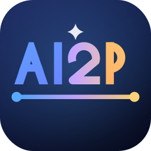
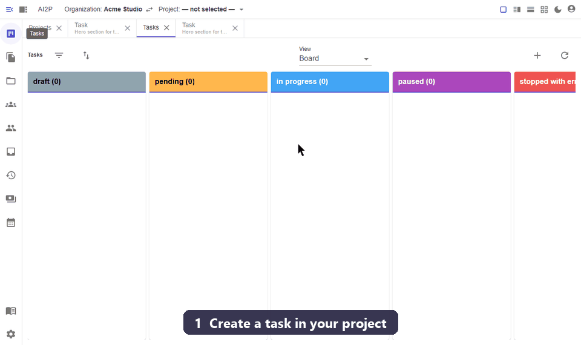
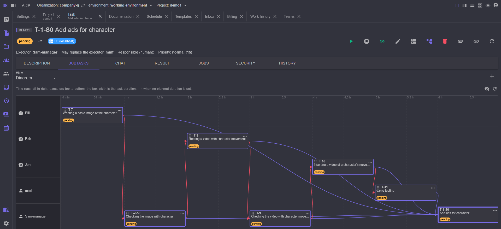

  
   
# AI2P — AI to People

### Планировщик задач на вашем компьютере, в котором исполнителем может быть ИИ-агент. Ваша Jira, где часть карточек делается сама.

* **Self-hosted — данные остаются у вас.** База, файлы проектов и ключи лежат рядом с программой. Windows, Linux, macOS.
* **Любые модели, включая локальные.** Claude, GPT, Gemini, DeepSeek, Qwen по API, Claude Code по подписке, локальные модели на своей видеокарте — и кластер из нескольких компьютеров.
* **Люди и ИИ в одной очереди.** Не «ИИ-агент вместо команды»: ИИ берёт то, что умеет, остальное ждёт людей, как в любом планировщике.

**[Быстрый старт](man/quickstart.md)** · **[Сайт](https://ai2p.org/ai2p)** · **[Скачать](https://github.com/mmf007/AI2P/releases)** · Без API-ключа AI2P работает как обычный планировщик для людей.

Подробное описание — ниже ↓

 
 
 
 
 
 
 
 
 
 
 
 
 
 

---

AI2P — это то, чем обычно бывает Trello или Jira: проекты, задачи, исполнители, доска,
история. Отличие одно, и оно меняет всё: **исполнителем задачи может быть ИИ**. Что ИИ умеет
сделать сам — он делает сам, в нужный момент и без напоминания; остальное остаётся людям и
ждёт их, как в любом планировщике.

Система работает **на вашем компьютере** (Windows 10–11, Linux, macOS), интерфейс — в
браузере. Данные никуда не уезжают: база, файлы проектов и ключи лежат рядом с программой.

## Оглавление

* [Что она делает](#что-она-делает)
* [Как это выглядит в работе](#как-это-выглядит-в-работе)
* [AI2P пишет сам себя](#ai2p-пишет-сам-себя)
* [Что нужно](#что-нужно)
* [Быстрый старт](#быстрый-старт)
* [Документация](#документация)
* [Партнерам и инвесторам](#партнерам-и-инвесторам)
* [Лицензия](#лицензия)

## Что она делает

* **Ведёт работу, а не только список дел.** У задачи есть исполнитель, срок, приоритет,
  критерии приёмки, блокирующие задачи и подзадачи. Завершение задачи само запускает
  следующие — те, что её ждали.
* **Подключает ИИ любого рода.** Текстовые модели по API (Claude, GPT, Gemini, DeepSeek,
  Qwen, GigaChat, YandexGPT и другие), Claude Code по подписке, локальные модели на вашей
  видеокарте, а также картинки, видео, звук и 3D. Все они — обычные исполнители: у каждого
  ник, навыки, цена и лимиты.
* **Подбирает исполнителя сама.** По навыкам задачи и настройке проекта «цена ↔ качество»
  система выбирает, кому её отдать, — сначала ИИ, потом человеку, или наоборот. Занятый или
  выбравший лимит исполнитель пропускается, задача ждёт освобождения.
* **Разбивает большую работу на части.** Агент может создать подзадачи и запустить их
  по приоритету; последняя задача группы подводит итог и, если что-то не сошлось, возвращает
  соседей в доработку.
* **Помнит опыт.** Уроки, добытые в работе, записываются к проекту, к узлу шаблона или ко
  всей организации и сами подставляются в следующее задание — своё для каждого навыка.
* **Повторяет типовые процессы.** Шаблон — это дерево задач с описаниями, навыками и
  порядком; из него одним действием разворачивается новый рабочий процесс.
* **Работает по расписанию** — от «каждый понедельник» до собственных действий системы,
  например автоматической архивации.
* **Живёт на нескольких компьютерах.** Серверы объединяются в кластер и реплицируют данные
  друг другу; у каждой задачи есть сервер-владелец, на котором она и выполняется, — так
  локальная модель считает там, где стоит видеокарта.
* **Забирает задачи из внешних систем** — Trello, GitHub, GitLab.
* **Держит ИИ в рамках.** Правила безопасности решают, что агенту разрешено, что требует
  подтверждения человека и что запрещено; за пределы папки проекта агент не выходит.
* **Говорит на вашем языке** — интерфейс, сообщения и промпты агентов берутся из словарей; выбор языка — в файле `README.md` рядом с каталогом `doc/`   

## Как это выглядит в работе
   

1. Заводите проект и указываете его папку — в ней агент будет читать и писать файлы.
2. Пишете задачу так же, как написали бы её человеку: заголовок, описание, критерии приёмки.
3. Нажимаете «запустить». Задача уходит ИИ-исполнителю, его работа видна в истории, вопросы
   он задаёт в чате задачи — и там же вы ему отвечаете.
4. Готовый результат ложится артефактом задачи, а сама задача встаёт на проверку. 

## AI2P пишет сам себя

AI2P разрабатывается в самом AI2P. Больше 140 выпусков, сотни задач: ТЗ, код, тесты,
документацию и сборку выкладки делают ИИ-исполнители, человек ставит задачи и принимает
результат. Каждый выпуск — это дерево задач: агент разбивает работу на подзадачи,
раздаёт их исполнителям, а последняя задача собирает итог и возвращает в доработку то,
что не сошлось. Так что это не демо на списке покупок, а продукт, который каждый день
доказывает работоспособность на самом себе — вместе с честными ошибками агентов и тем,
как они исправлялись.

## Что нужно

* Windows 10/11, Linux или macOS; права администратора — только на установку.
* Больше ничего: берите **полный пакет** — `AI2P_v_1_NN_full_windows_x64.exe` для Windows,
  `AI2P_v_1_NN_full_linux_x64.run` для Linux, `AI2P_v_1_NN_full_macos_arm64.run` для macOS.
  Всё нужное для запуска лежит у него внутри, ставить .NET отдельно не надо.
  (Пакет без `full` в имени меньше, но ждёт уже установленный рантайм ASP.NET Core 8.x.)
* Ключ API того ИИ, которым будете пользоваться, — или подписка Claude Code, или видеокарта
  для локальных моделей. Без модели система работает как обычный планировщик для людей.

## Быстрый старт 
первый запуск за несколько минут смотри [Быстрый старт](man/quickstart.md)  
[Дистрибутивы лежат здесь](https://github.com/mmf007/AI2P/releases) — берите пакет с `full` в имени  

## Документация
Подробную документацию смотри  [Документация](index.md)  

Разделы: [Руководство](man/README.md) · [ИИ-модели](models/README.md) ·
[Импорт задач](import/README.md) · [Плагины и MCP](plugins/README.md) ·
[Наборы опыта](packs/README.md)  

## Партнерам и инвесторам 

Если вы хотите внести свой вклад в разработку, запустить коммерческое решение на базе проекта или обсудить инвестиции, пожалуйста, ознакомьтесь с нашей [Страницей для партнеров и инвесторов](PARTNERS.md). 

## Лицензия  

Этот проект распространяется под свободной лицензией **Apache License 2.0** — полный текст условий доступен в файле [LICENSE](../../LICENSE).

